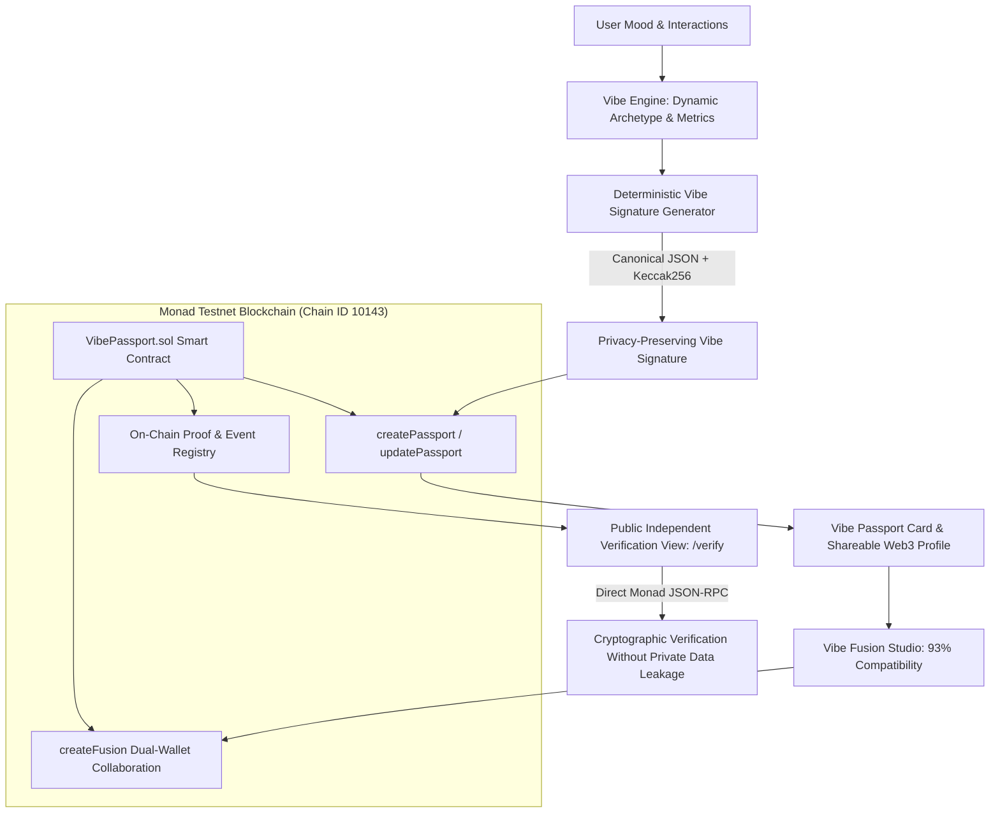

# 🌌 VibeVerse

### *"Your Taste. Your Identity. Your Vibe."*

<p align="center">
  
  
  
  
</p>

<p align="center">
  <b>AI-Powered Entertainment Discovery & Verifiable Web3 Taste Identity on Monad Testnet</b><br/>
  <sub>🏆 Monad Blitz Hackathon Submission</sub>
</p>

---

## 📑 Table of Contents

- [What Problem Does It Solve?](#-what-problem-does-it-solve)
- [Why Monad?](#-why-monad)
- [Architecture](#️-architecture)
- [Smart Contract](#-smart-contract)
- [Key Features](#-key-features)
- [Screenshots](#-screenshots)
- [Installation & Quickstart](#-installation--quickstart)
- [Automated Testing](#-automated-testing)
- [Team & Acknowledgments](#-hackathon-team--acknowledgments)

---

## 🌟 What Problem Does It Solve?

Centralized streaming platforms (Netflix, Spotify, YouTube) track what you watch and listen to, but lock your entertainment taste inside walled gardens. You don't own your recommendations, you can't carry your taste across applications, and collaborating with friends requires clunky manual playlist sharing.

**VibeVerse** transforms entertainment discovery into a **privacy-preserving, user-owned digital identity**:

1. Discover cinema and music tailored to your exact mood.
2. Formulate your evolving taste into a digital **Vibe Passport**.
3. Generate a deterministic, cryptographic **Vibe Signature** (`keccak256`) that remains verifiable on-chain without exposing private viewing history.
4. Collaborate using **Vibe Fusion** to synthesize dual-wallet compatibility on Monad.

---

## ⚡ Why Monad?

Blockchain in VibeVerse is **not a gimmick**:

- **High Throughput & Sub-Second Finality** — Updating dynamic taste profiles and forging collaborative Vibe Fusions requires instantaneous transaction confirmation without lag.
- **Micro-Gas Economics** — Minting and updating passports frequently as your taste evolves is only economically viable on Monad's gas-optimized architecture.
- **Verifiable Consensus** — Monad provides a decentralized truth layer for taste ownership and dual-identity collaborations across the decentralized web.

---

## 🏗️ Architecture



### Privacy Model: Off-Chain vs On-Chain

| Dimension | Off-Chain (Strictly Private) | On-Chain (Monad Testnet) |
| :--- | :--- | :--- |
| **Data** | Movie watch history, music plays, personal analytics | Deterministic Vibe Signature hash, Archetype name, Energy/Exploration scores |
| **Storage** | Client-side Local Storage & Encrypted cache | Monad Smart Contract (`VibePassport.sol`) |
| **Access** | User device only | Publicly verifiable via Monad RPC / Explorer |

---

## 📜 Smart Contract

| Field | Value |
| :--- | :--- |
| **Contract Name** | `VibePassport` |
| **Network** | Monad Testnet |
| **Chain ID** | `10143` (`0x279f`) |
| **RPC URL** | `https://testnet-rpc.monad.xyz` |
| **Currency** | `MON` |
| **Contract Address** | [`0x8A791620dd6260079BF849Dc5567aDC3F2FdC318`](https://testnet.monadexplorer.com/address/0x8A791620dd6260079BF849Dc5567aDC3F2FdC318) |
| **Explorer** | [testnet.monadexplorer.com](https://testnet.monadexplorer.com) |

### Key Functions

```solidity
createPassport(string archetype, bytes32 vibeSignature, uint8 energy, uint8 exploration, uint8 nostalgia, string metadataURI)
updatePassport(uint256 passportId, string archetype, bytes32 vibeSignature, ...)
createFusion(address partner, bytes32 fusionSignature, uint8 compatibilityScore, string sharedVibe, string metadataURI)
getPassport(uint256 passportId)
verifyVibeSignature(uint256 passportId, bytes32 expectedSignature)
```

---

## 🚀 Key Features

### 1. 🪪 Digital Vibe Passport
- Live taste archetypes: **🌌 Night Explorer**, **⚡ Hyper Kinetic**, **🌙 Cosmic Dreamer**, **🧭 Astral Nomad**, **☀️ Solar Optimist**, **🎞️ Vintage Cinephile**.
- Real-time score tracks for **Energy**, **Exploration**, and **Nostalgia**.
- Real-time transaction lifecycle modal: *Generating Signature ➜ Preparing TX ➜ Waiting for Wallet ➜ Monad Consensus ➜ Verified*.

### 2. 🔮 Dual-Wallet Vibe Fusion Studio
- Merge two Web3 wallets/passports.
- Calculates true multi-metric taste compatibility (e.g., **93% Match**).
- Synthesizes shared aesthetic curations (*"MIDNIGHT ADVENTURE"*).
- Registers collaborative fusion proofs on Monad Testnet.

### 3. 📈 Vibe Evolution Timeline
- Tracks how entertainment taste matures across mood sessions over time.

### 4. ✓ Standalone Public Verification
- Zero-login on-chain RPC lookup to verify passport authenticity and cryptographic signatures.

---

## 📸 Screenshots

> Place your screenshot files in a `screenshots/` folder at the root of this repo, using the filenames below — GitHub can only render images that live inside the repo (or a public URL), not local file paths from your computer.

| Feature | Preview |
| :--- | :--- |
| **Vibe Passport** |  |
| **Monad Transaction Lifecycle** |  |
| **Vibe Fusion Studio** |  |
| **Public Verification** |  |

---

## 💻 Installation & Quickstart

### Prerequisites
- [Node.js](https://nodejs.org) (v18+)
- [MetaMask](https://metamask.io) or compatible Web3 wallet configured with Monad Testnet.

### 1. Clone & Install
```bash
git clone https://github.com/dhruva/VibeVerse.git
cd VibeVerse
npm install
```

### 2. Configure Environment
Create `.env` and `server/.env` based on `.env.example`:
```env
PORT=5174
TMDB_API_KEY=your_tmdb_api_key
YOUTUBE_API_KEY=your_youtube_api_key
MONAD_RPC_URL=https://testnet-rpc.monad.xyz
```

### 3. Compile Smart Contract
```bash
node contracts/compile.js
```

### 4. Start Development Servers
```bash
# Terminal 1: Backend API Proxy (Port 5174)
cd server && node index.js

# Terminal 2: Frontend Vite App (Port 5173)
npm run dev
```

Open [http://localhost:5173](http://localhost:5173) in your browser.

---

## 🧪 Automated Testing

Run the full end-to-end Monad Blitz verification test suite with Puppeteer:

```bash
node test-monad-blitz.js
```

---

## 👥 Hackathon Team & Acknowledgments

- Built with 💜 for the **Monad Blitz Hackathon**.
- Shoutout to `@monad`, `@monad_dev`, and `@geeky_kartikey` for developer support and documentation!
